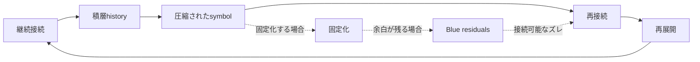

# 02. Core Model

このメモでは、HSSの中核候補を **L4〜L6の接続サイクル** として仮置きします。
固定された理論ではなく、継続接続がどのように積層し、圧縮され、再接続・再展開されるかを見るための観測用モデルです。

L1〜L3は、現時点では具体的に定義しません。　
L7・L8は、現時点では予約層として扱います。

感情、身体的欲求、脳生理的反応、情熱、衝動などは、より深い層に位置づけられる可能性がありますが、このメモでは明示的なモデル対象とはしません。

この文書では、L4〜L6付近に見える接続・圧縮・再接続・再展開の循環のみを扱います。
ここでは、L4〜L6で見える接続構造だけを軽く扱います。

## L4〜L6 接続サイクル

## 読み方

- **L4**: 継続接続や積層historyが見え始める接続領域。
- **L5**: symbolとして圧縮されたり、固定化したりする観測点。
- **L6**: 再接続と再展開によって、接続がもう一度動き出す循環点。

L4〜L6は固定された段階ではなく、
接続が積層・圧縮・再接続される中で、
観測されやすい接続領域として仮置きしています。

## 観測メモ

- 継続接続は、時間の中で積層historyを作ることがある。
- 積層された接続は、symbolとして圧縮されることがある。
- 圧縮されたsymbolは、再接続のきっかけになることがある。
- 再接続が起きると、意味や文脈が再展開することがある。
- 固定化しても、Blue residualsが残る場合は、再接続可能性を保つことがある。

## 扱い

この図は、説明を完成させるためのものではありません。
観測対象の中で、接続・固定化・余白・再展開がどのように見えるかを確認するための軽い作業図です。
