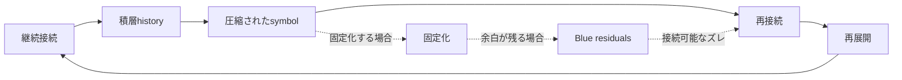

# 02. Core Model

このメモでは、HSSの中核候補を **L4〜L6の接続サイクル** として仮置きします。
固定された理論ではなく、継続接続がどのように積層し、圧縮され、再接続・再展開されるかを見るための観測用モデルです。

L1〜L3は、現時点では前段観測層として暫定的に置きます。
L7・L8は、現時点では予約層として扱います。

## 0. L1〜L3の暫定的な置き方

L1〜L3は、人間本質や脳生理を定義する層ではありません。

HSSでは、symbolや出来事が場に触れ、反応や痕跡として残り、処理形式へルーティングされるまでの前段観測層として仮置きします。

- L1: 接触層
- symbol、出来事、言葉、映像、音、数値、制度、他者の反応などが、受け手や場に触れる層。
- L2: 反応・痕跡層
- 接触したものが、違和感、記憶、反応、クリック、保存、会話、気になる感じ、処理負荷などの痕跡として残る層。
- L3: 処理・ルーティング層
- 残った痕跡や反応が、KPI、評価制度、フィード、ランキング、伝票、指数、株価、再生数、承認、役割などの処理形式へ振り分けられる層。

L4〜L6では、L1〜L3で生じた接触、反応、痕跡、処理形式が、継続接続、再接続、再展開、固定化、積層historyとして観測可能になるかを扱います。

これは暫定的な観測上の置き方であり、完全な層定義ではありません。

そのため、観測対象の中心はL4〜L6付近に見える接続・圧縮・再接続・再展開の循環に置きます。

感情、身体的欲求、脳生理的反応、情熱、衝動などは、より深い層に位置づけられる可能性がありますが、このメモでは明示的なモデル対象とはしません。

## L4〜L6 接続サイクル

## コアモジュールの扱い

HSSそのものは、このコアモジュールそのものではありません。

HSSは、接続しているように見える現象を、接続元、接続先、媒介symbol、処理形式、痕跡、ルーティングへ分解するための構造観測OSです。

このコアモジュールは、HSSで分解した接続構造を読むための、現時点での最小接続モデルです。

したがって、コアモジュールはHSSそのものではなく、HSSによって分解された接続構造を整理するための最小単位です。

このサイクル図は、HSSの現時点での中核モジュールです。

HSSでは、複数領域で反復して見える「継続して接続されるものが履歴化し、圧縮されたsymbolとなり、再接続や再展開のきっかけになる」という“よくある流れ”を、接続構造の最小コアモジュールとして仮置きします。

これは、必ずこの順番で現象が進むという決定論的な因果法則ではありません。

一方で、単なる任意の例示でもありません。

このモジュールは、HSSが観測を始めるための入口です。

ただし、このモジュールは抽象度が高いため、似た流れが見えるだけではHSS観測が成立したとは扱いません。

HSS観測として一定の強さを持つには、次の追加観測点が必要です。

- L1〜L3における接触、反応・痕跡、処理・ルーティングが具体的に示せる。
- 何がどの処理形式へ変換されたのかを示せる。
- その処理形式によって、元の接続先へ戻る経路が太くなったのか、細ったのかを示せる。
- 固定化、Blue residuals、接続可能なズレ、揺り戻し欠損、目的関数の捕獲など、HSS固有の観測語彙が機能している。
- 通常の説明との差分が出ている。

これらが示せない場合、その対象はコアモジュールに似て見えても、HSS観測としては弱いものとして扱います。

この意味で、コアモジュールはHSS観測の十分条件ではなく、観測を開始するための最小パターンです。

## なぜ最小モジュールと呼ぶのか

このモジュールを最小と呼ぶのは、HSSが横断的に観測している構造を、次の要素まで縮約しているためです。

- 時間の中で何かが保たれること。
- それが履歴や文脈として積み重なること。
- 積み重なったものが、共有、保存、想起、評価、流通のためにsymbolや処理形式へ圧縮されること。
- 圧縮されたsymbolや処理形式が、過去の文脈や記憶を呼び戻すきっかけになること。
- 呼び戻されたものが、別の解釈、行動、創作、関係性、運用へ再展開すること。

これらのいずれかを外すと、HSSが観測したい「積層したものが圧縮され、再接続や再展開へ戻れるか」という問いが弱くなります。

ただし、これはこの順序が常に成立するという意味ではありません。

## 矢印の暫定的な読み方

各矢印は、必ず発生する因果関係ではなく、観測時に確認する遷移候補です。

- 継続接続 → 積層history
- 時間、反復、記憶、関係性、運用、失敗、違和感が重なると、履歴として観測されやすい。
- 積層history → 圧縮されたsymbol
- 積み重なった履歴や文脈は、共有、想起、保存、流通、評価のために短いsymbolや処理形式へ圧縮されやすい。
- 圧縮されたsymbol → 再接続
- symbolは、過去の記憶、文脈、違和感、関係性を呼び戻すきっかけになる。
- 再接続 → 再展開
- 呼び戻された文脈は、別の解釈、行動、創作、関係性、運用へ広がりうる。
- 再展開 → 継続接続
- 広がった解釈や関係が、再び時間の中で反復・維持されると、継続接続として観測される。
- 圧縮されたsymbol → 固定化
- symbolが高速共有、評価、再利用、短期反応に適応すると、単一の意味や役割へ閉じやすい。
- 固定化 → Blue residuals
- 固定化しても、未収束の解釈余地、違和感、痕跡、再接続可能性が残ることがある。
- Blue residuals → 再接続
- 残った余地や痕跡は、後から別の文脈で再び呼び戻されることがある。

この矢印が観測できない場合、その対象ではHSSサイクルを強く主張しません。

## 読み方

- **L4**: 継続接続や積層historyが見え始める接続領域。
- **L5**: symbolとして圧縮されたり、固定化したりする観測点。
- **L6**: 再接続と再展開によって、接続がもう一度動き出す循環点。

L4〜L6は固定された段階ではなく、
接続が積層・圧縮・再接続される中で、
観測されやすい接続領域として仮置きしています。

## 観測メモ

- 継続接続は、時間の中で積層historyを作ることがある。
- 積層された接続は、symbolとして圧縮されることがある。
- 圧縮されたsymbolは、再接続のきっかけになることがある。
- 再接続が起きると、意味や文脈が再展開することがある。
- 固定化しても、Blue residualsが残る場合は、再接続可能性を保つことがある。

## 扱い

この図は、説明を完成させるためのものではありません。
観測対象の中で、接続・固定化・余白・再展開がどのように見えるかを確認するための軽い作業図です。
