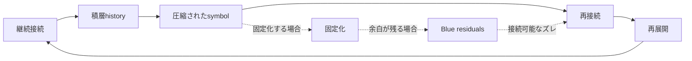

# 02. Core Model

このメモでは、HSSの中核候補を **L4〜L6の接続サイクル** として仮置きします。
固定された理論ではなく、継続接続がどのように積層し、圧縮され、再接続・再展開されるかを見るための観測用モデルです。

L1〜L3は、現時点では前段観測層として暫定的に置きます。
L7・L8は、現時点では予約層として扱います。

## 0. L1〜L3の暫定的な置き方

L1〜L3は、人間本質や脳生理を定義する層ではありません。

HSSでは、symbolや出来事が場に触れ、反応や痕跡として残り、処理形式へルーティングされるまでの前段観測層として仮置きします。

- L1: 接触層
- symbol、出来事、言葉、映像、音、数値、制度、他者の反応などが、受け手や場に触れる層。
- L2: 反応・痕跡層
- 接触したものが、違和感、記憶、反応、クリック、保存、会話、気になる感じ、処理負荷などの痕跡として残る層。
- L3: 処理・ルーティング層
- 残った痕跡や反応が、KPI、評価制度、フィード、ランキング、伝票、指数、株価、再生数、承認、役割などの処理形式へ振り分けられる層。

L4〜L6では、L1〜L3で生じた接触、反応、痕跡、処理形式が、継続接続、再接続、再展開、固定化、積層historyとして観測可能になるかを扱います。

これは暫定的な観測上の置き方であり、完全な層定義ではありません。

そのため、観測対象の中心はL4〜L6付近に見える接続・圧縮・再接続・再展開の循環に置きます。

感情、身体的欲求、脳生理的反応、情熱、衝動などは、より深い層に位置づけられる可能性がありますが、このメモでは明示的なモデル対象とはしません。

この文書では、L4〜L6付近に見える接続・圧縮・再接続・再展開の循環のみを扱います。

## L4〜L6 接続サイクル

## 読み方

- **L4**: 継続接続や積層historyが見え始める接続領域。
- **L5**: symbolとして圧縮されたり、固定化したりする観測点。
- **L6**: 再接続と再展開によって、接続がもう一度動き出す循環点。

L4〜L6は固定された段階ではなく、
接続が積層・圧縮・再接続される中で、
観測されやすい接続領域として仮置きしています。

## 観測メモ

- 継続接続は、時間の中で積層historyを作ることがある。
- 積層された接続は、symbolとして圧縮されることがある。
- 圧縮されたsymbolは、再接続のきっかけになることがある。
- 再接続が起きると、意味や文脈が再展開することがある。
- 固定化しても、Blue residualsが残る場合は、再接続可能性を保つことがある。

## 扱い

この図は、説明を完成させるためのものではありません。
観測対象の中で、接続・固定化・余白・再展開がどのように見えるかを確認するための軽い作業図です。
