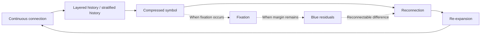

# 02. Core Model

This memo provisionally places the core candidate of HSS as the **L4–L6 connection cycle**.
It is not a fixed theory, but an observational model for seeing how continuous connection may become layered, compressed, reconnected, and re-expanded.

The Japanese source is canonical.
English terminology is provisional.

L1–L3 are not concretely defined in the current version.
L7 and L8 are treated as reserved layers at the current stage.

L1–L3 may relate to lower foundations that allow connections to take shape, such as media, institutions, physical infrastructure, language foundations, or platform environments.

However, in the current version of HSS, these are not defined as explicit layers.

This is to avoid turning HSS into an overly fixed layered model.

For that reason, the center of observation is placed on the cycle of connection, compression, reconnection, and re-expansion that appears around L4–L6.

Emotion, bodily desire, neurophysiological response, passion, impulse, and related phenomena may be positioned in deeper layers, but they are not explicit model targets in this memo.

This document deals only with the cycle of connection, compression, reconnection, and re-expansion that appears around L4–L6.

## L4–L6 Connection Cycle

## How to read this

- **L4**: A connection area where continuous connection and layered history / stratified history begin to become visible.
- **L5**: An observation point where something may be compressed as a symbol or may become fixed.
- **L6**: A cyclic point where connection begins to move again through reconnection and re-expansion.

L4–L6 are not fixed stages.
They are provisionally placed as connection areas that tend to be observed while connections are layered, compressed, and reconnected.

## Observation memo

- Continuous connection may create layered history / stratified history over time.
- Layered connections may be compressed as symbols.
- A compressed symbol may become a trigger for reconnection.
- When reconnection occurs, meaning or context may re-expand.
- Even if fixation occurs, when Blue residuals remain, reconnectability may be maintained.

## Treatment

This diagram is not intended to complete an explanation.
It is a light working diagram for checking how connection, fixation, margin, and re-expansion may appear within the observation target.
