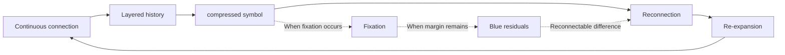

# 02. Core Model

This memo provisionally places the core candidate of HSS as the **L4–L6 connection cycle**.
It is not a fixed theory, but an observational model for seeing how continuous connection may become layered, compressed, reconnected, and re-expanded.

The Japanese source is canonical.
English terminology is provisional.

L1–L3 are provisionally placed as front-stage observation layers at the current stage.
L7 and L8 are treated as reserved layers at the current stage.

## 0. Provisional placement of L1–L3

L1–L3 are not layers for defining human essence or neurophysiology.

In HSS, they are provisionally placed as front-stage observation layers up to the point where symbols or events touch a receiver or field, remain as reactions or traces, and are routed into processing forms.

- L1: Contact layer — a layer in which symbols, events, words, images, sounds, numbers, institutions, and others’ reactions touch a receiver or field.
- L2: Reaction / trace layer — a layer in which what touched the receiver or field remains as discomfort, memory, reaction, click, save, conversation, lingering concern, or processing load.
- L3: Processing / routing layer — a layer in which remaining traces or reactions are routed into processing forms such as KPIs, evaluation systems, feeds, rankings, invoice bundles, indexes, stock prices, view counts, approval, or roles.

L4–L6 observe whether contacts, reactions, traces, and processing forms from L1–L3 become observable as continuous connection, reconnection, re-expansion, fixation, or layered history.

This is a provisional observation placement, not a complete layer definition.

For that reason, the center of observation is placed on the cycle of connection, compression, reconnection, and re-expansion that appears around L4–L6.

Emotion, bodily desire, neurophysiological response, passion, impulse, and related phenomena may be positioned in deeper layers, but they are not explicit model targets in this memo.

## L4–L6 connection cycle

## How to read this

- **L4**: A connection area where continuous connection and layered history / stratified history begin to become visible.
- **L5**: An observation point where something may be compressed as a symbol or may become fixed.
- **L6**: A cyclic point where connection begins to move again through reconnection and re-expansion.

L4–L6 are not fixed stages.
They are provisionally placed as connection areas that tend to be observed while connections are layered, compressed, and reconnected.

## Handling of the core module

HSS itself is not this core module.

HSS is a structural observation OS for decomposing phenomena that appear to be connected into connection source, connection destination, mediating symbol, processing form, traces, and routing.

This core module is the current minimum connection model for reading connection structures decomposed by HSS.

This is not a deterministic causal law.

It is also not an arbitrary example.

It is an entry point for HSS observation.

Because it is abstract, a similar flow alone does not establish HSS observation.

Additional observation points are needed, such as what is maintained over time, what is compressed into which processing form, what route becomes narrower, and whether reconnection, re-expansion, fixation, Blue residuals, or layered history can be observed.

It is not a sufficient condition, but a minimum pattern for starting observation.

## Why call it a minimum module?

It is called a minimum module because the current HSS core observes whether the following pattern can be provisionally traced.

- Something is maintained over time.
- It layers as history or context.
- Layered things are compressed into symbols or processing forms for sharing, saving, recall, evaluation, or circulation.
- Compressed symbols or processing forms trigger recall of past context or memory.
- Recalled things re-expand into other interpretations, actions, creative works, relationships, or operations.

## Provisional reading of the arrows

The arrows in the diagram are provisional observation readings, not deterministic transitions.

- continuous connection → layered history: continued connection may layer as history or context.
- layered history → compressed symbol: layered things may be compressed into a short symbol or processing form.
- compressed symbol → reconnection: a compressed symbol may trigger return to past context or memory.
- reconnection → re-expansion: recalled context may expand into another interpretation, action, creative work, relationship, or operation.
- re-expansion → continuous connection: re-expanded activity may become another continuing connection.
- compressed symbol → fixation: compression may close meaning into a single interpretation, role, evaluation, or reaction.
- fixation → Blue residuals: even when fixation occurs, unresolved room or traces may remain.
- Blue residuals → reconnection: remaining room may later become a route for reconnection.

## Treatment

This diagram is not intended to complete an explanation.
It is a light working diagram for checking how connection, fixation, margin, and re-expansion may appear within the observation target.
